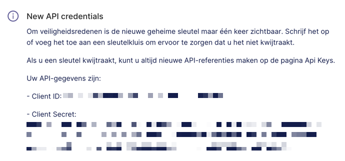

# Microsoft Power BI

### Summary

This document explains the steps needed to prepare your Power BI environment for setting up a dScribe connection.

For the official documentation by Microsoft, see [here](https://docs.microsoft.com/en-us/power-bi/admin/service-admin-metadata-scanning-setup).

### Step-by-step guide

1.  Go to Azure Active Directory (AAD)

    a.     Go to [https://portal.azure.com/#home](https://portal.azure.com/#home)

    b.     Select Azure Active Directory:\
    &#x20;       .png>)\

2.  Create an app registration\
    .png>)\
    \
    .png>)\
    \
    TIP 1: remember the name of your application, you will need it later

    &#x20;

    TIP 2: (important!) Make sure there are no Power BI admin-consent-required permissions set on this application.\

3. Navigate back to your application via Azure Active Directory > App Registrations > Select your newly created App and copy the **Application (client) ID** somewhere safe. You will need it later.\
   .png>)\

4. In your application, navigate to 'Certificates & secrets' and create a new client secret:\
   .png>)\

5. Copy the client secret **value**\
   ****.png>)\

6. Go back to Azure Active Directory > Overview and copy the **Tenant ID**\
   ****\

7. Create a new Security Group via Azure portal > Azure Active Directory > Groups (optional: you can choose to reuse an existing group)\
   .png>)\

8. Add your App (see Step 2) as a member of the security group you created\
   .png>)\

9. Navigate to PowerBI via app.powerbi.com and log in with a user with administrator authorizations\

10. Go to Admin portal > Tenant settings > Admin API settings

    a.     Set 'Allow service principles to use read-only Power BI admin APIs' to Enabled

    b.     Add the security group you created earlier\
    \
    .png>)\

11. While you're here, make sure these settings are applied as well: You can select ‘The entire organization’ or use the same security group as above.\
    .png>)\

12. Using the Tenant ID, Application (client) ID and secret value, create a new Connection in dScribe

#### All done! Congratulations!

### Known limitations

For older Power BI datasets, the dataset elements might not be retrieved when running the dScribe job. See [here](https://docs.microsoft.com/en-us/power-bi/admin/service-admin-metadata-scanning-setup#model-caching).
