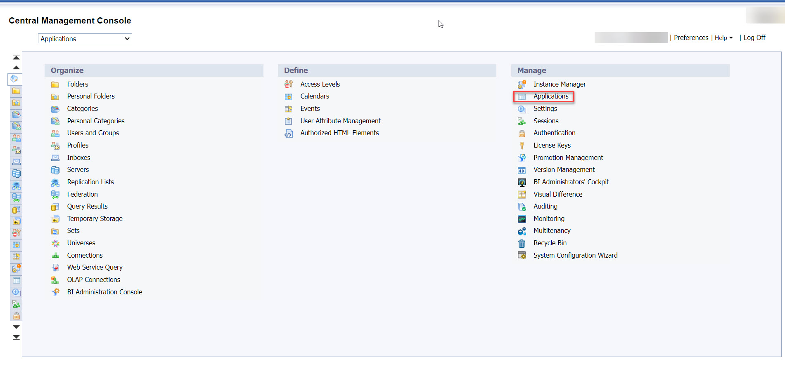
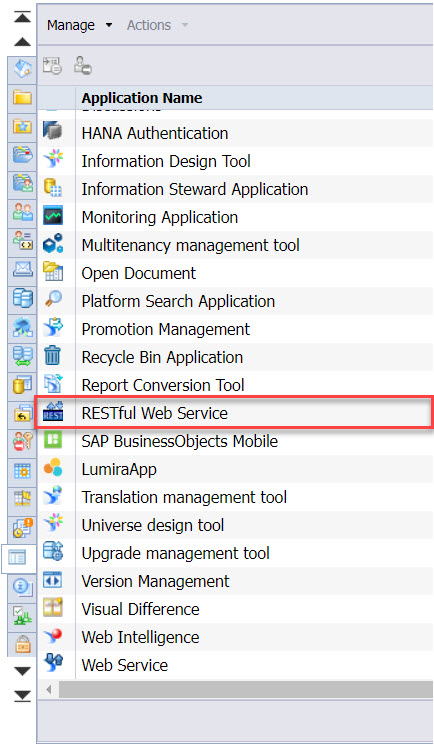
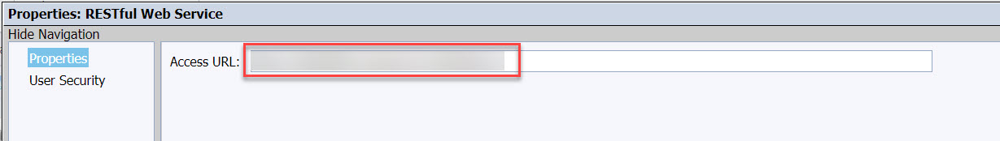
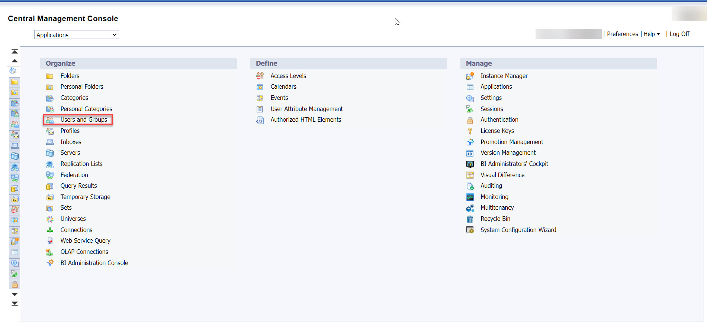
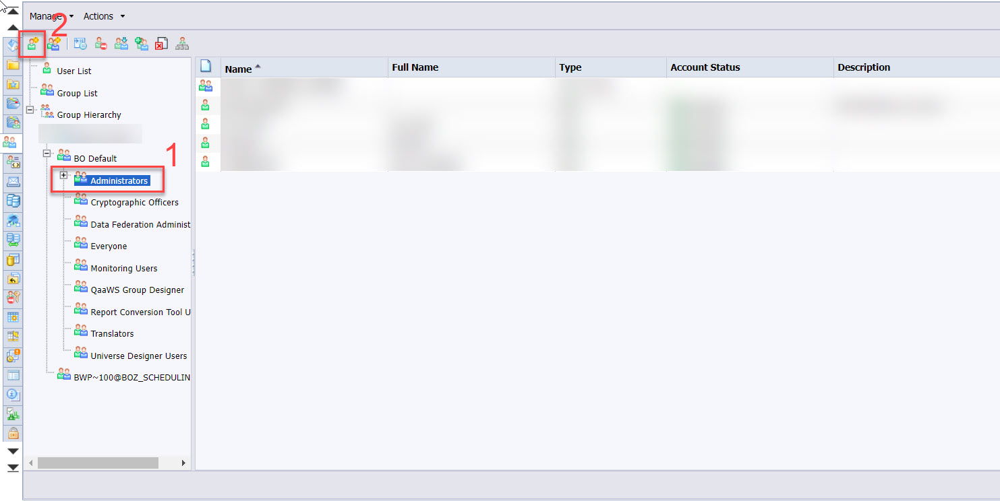
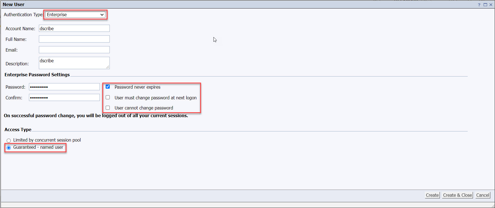
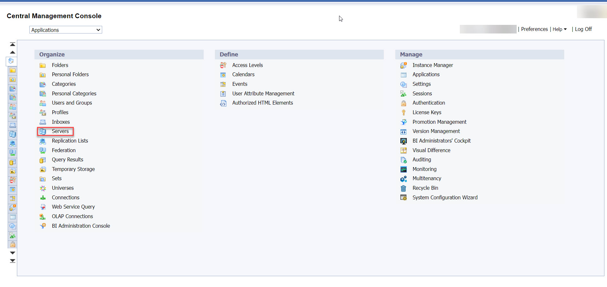
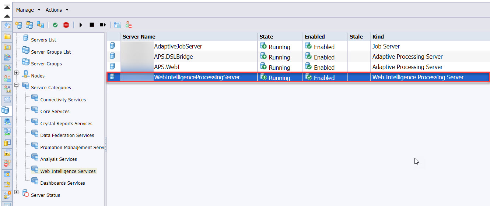
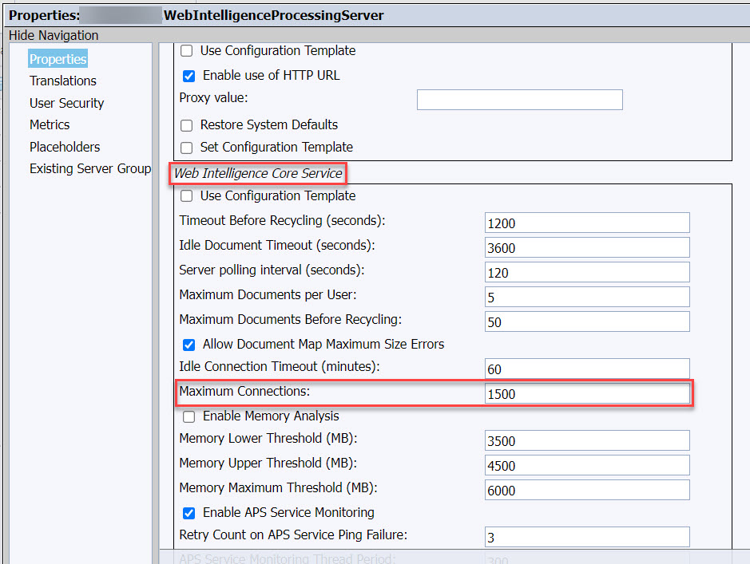

# SAP BusinessObjects

### Summary

This document explains the steps needed to prepare your SAP BusinessObjects (BO) environment for setting up a dScribe connection.

### Step-by-step guide

1. Log in on your **BO CMC** (Central Management Console) via a user with administrator rights.
2. Navigate to **Applications** > **RESTful Web Service**\
   \
   \

3. Copy the **Access URL**\
   ****\

4. Navigate to **Users and Groups** via the homepage\
   ****\

5. Select **Administrators** beneath **BO Default** and create a new user\
   \

6. Navigate to **Servers** via the homepage\
   \

7. Double click on **Web Intelligence Services**\
   ****\

8. Double click on **WebIntelligenceProcessingServer**\
   ****\

9. Search for the property **Maximum Connections** and set it to **1500**\
   ****\
   \
   This is needed because the API is causing a heavy load on your BO system and increasing the maximum connections will prevent from slowing down your system.\

10. Using the **Access URL**, **Account Name** and **Password**, you can now create a new Connection in dScribe.

**Reached the end? Congratulations! You’re a star!** :star:****\
****
