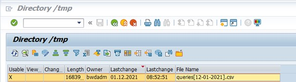

# SAP Business Warehouse (BW) on HANA or BW4/HANA

AVAILABLE METADATA

Via this file based connector, all SAP BW queries available in a SAP BW client can be automatically cataloged, including information on which InfoProvider these are built.

&#x20;The following metadata is retrieved per BW Query: (in bold indicated the fields made visible in dScribe). Some of the fields are not used but are made available as per standard output by SAP.

* **MAPNAME**: the technical name of the BW query
* NODE\_KEY: L1 hierarchy
* RELATKEY: the hierarchical structure used to link objects which eachother
* **OBJECT**: Type of SAP BW object (Query, CompositeProvider, DatastoreObject, Filter,Characteristic restriction, Selection, Variable,..)
* **TEXT:** the description of the query
* VALUE: the technical value of the individual BW object (per line
* OBJVERS: brings along whether or not the object is ‘A(ctive)’ and thus usable.
* COMPID: technical field containing the query name (only on the query available)
* VERSION: technical field containing the version of the object (not used further in dScribe)
* COMPDIM: technical field containing the dimension of the object (not used further in dScribe)
* OBJSTAT: description of the ‘OBJVERS’ object (ACT being Active)
* CONTREL: not used
* CONTTIMESTMP: not used
* OWNER: the person who originally created the BW query
* BWAPPL: not used
* ACTIVFL: ‘X’ indicates the object is active
* TIMESTMP: Timestamp of last change of the BW query
* TSTPNM: Name of the person that has last changed the object
* TSTPDAT: Date of the last change
* TSTPTIM: Time of the last change
* LASTUSED: Timestamp of the last time the object was used
* CREATED: Timestamp of creation of the BW query
* CHANGED\_WITH: not used
* INFOAREA: SAP BW Infoarea under which the BW query is saved.&#x20;

## TECHNICAL SETUP

Due to licensing constraints, dScribe cannot read directly from the underlying BW database.

To anyhow obtain the required information, a program was created to consolidate the needed information in a CSV file, that can be run in batch. The output file can be loaded, also in batch, into dScribe.

As this program is dScribe specific, the following steps need to be run through in order for the CSV file to be made available.


BW extractor zip file


The zip file contains 2 files that will have to be made available on the corresponding BW repositories:

·         **K907593.B4D** -> needs to be transferred to folder: /usr/sap/trans/cofiles

·         **R907593.B4D** -> needs to be transferred to folder: /usr/sap/trans/data

<figure><figcaption>
Custom program to upload BW extractor program
</figcaption></figure>

The import can be performed by either a FTP tool used, or by e.g. a custom program with the example code below:

zbw_imp_transp_file

REPORT zbw\_imp\_transp\_file MESSAGE-ID zbw\_exp\_query\_info.

INCLUDE zbw\_imp\_transp\_filesrc. " UI

START-OF-SELECTION.

START-OF-SELECTION.&#x20;

CALL FUNCTION 'ARCHIVFILE\_CLIENT\_TO\_SERVER'&#x20;

EXPORTING&#x20;

path = lfile&#x20;

targetpath = file&#x20;

EXCEPTIONS&#x20;

error\_file = 1&#x20;

OTHERS = 2.&#x20;

IF sy-subrc <> 0.&#x20;

MESSAGE i001.

ELSE.&#x20;

CALL FUNCTION 'ARCHIVFILE\_CLIENT\_TO\_SERVER'&#x20;

EXPORTING&#x20;

path = co\_lfile&#x20;

targetpath = co\_file&#x20;

EXCEPTIONS error\_file = 1&#x20;

OTHERS = 2.

&#x20;IF sy-subrc <> 0.&#x20;

MESSAGE i001.&#x20;

ELSE.&#x20;

MESSAGE s002.&#x20;

ENDIF.&#x20;

ENDIF.

Via STMS the ‘K907593.B4D transport request can be added via:

<figure><figcaption></figcaption></figure>

<figure><figcaption></figcaption></figure>

The transport request will be added to the queue , now you can select and import it to your system

## Running the program

The following program should now be available: ZBW\_EXP\_QUERY\_INFO\_V3

&#x20;This can be run via transaction: SE38 in (background)

<figure><figcaption></figcaption></figure>

<figure><figcaption></figcaption></figure>

&#x20;The program output will be displayed

<figure><figcaption></figcaption></figure>

Additionally the output file is created (and visible via TA AL11 in the directory as defined when running the program)

<figure><figcaption></figcaption></figure>

**`Remarks:`**

1. The formatting of the file will always be as per above ‘queries\[date].csv&#x20;
2. To schedule the program to run frequently, we recommend foreseeing the program in a process chain and thus integrating this in an already existing batch job.

## Copying the file to a server or as a local file

Unfortunately copying server files to a local file cannot be automated nor run in batch.

&#x20;The following program should be run: **ZBW\_EXP\_QUERY\_FILE**

<figure><figcaption>
SE38 : <strong>ZBW_EXP_QUERY_FILE</strong>
</figcaption></figure>

## Upload CSV file into dScribe

<figure><figcaption></figcaption></figure>

