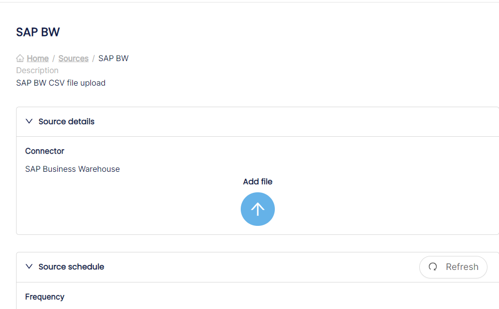

# SAP Business Warehouse (BW)

AVAILABLE METADATA

Via this file based connector, all SAP BW queries available in a SAP BW client can be automatically cataloged, including information on which InfoProvider these are built.

The following metadata is retrieved per BW Query: (in bold indicated the fields made visible in dScribe). Some of the fields are not used but are made available as per standard output by SAP.

* **MAPNAME**: the technical name of the BW query
* NODE\_KEY: L1 hierarchy
* RELATKEY: the hierarchical structure used to link objects which eachother
* **OBJECT**: Type of SAP BW object (Query, CompositeProvider, DatastoreObject, Filter,Characteristic restriction, Selection, Variable,..)
* **TEXT:** the description of the query
* VALUE: the technical value of the individual BW object (per line
* OBJVERS: brings along whether or not the object is ‘A(ctive)’ and thus usable.
* COMPID: technical field containing the query name (only on the query available)
* VERSION: technical field containing the version of the object (not used further in dScribe)
* COMPDIM: technical field containing the dimension of the object (not used further in dScribe)
* OBJSTAT: description of the ‘OBJVERS’ object (ACT being Active)
* CONTREL: not used
* CONTTIMESTMP: not used
* OWNER: the person who originally created the BW query
* BWAPPL: not used
* ACTIVFL: ‘X’ indicates the object is active
* TIMESTMP: Timestamp of last change of the BW query
* TSTPNM: Name of the person that has last changed the object
* TSTPDAT: Date of the last change
* TSTPTIM: Time of the last change
* LASTUSED: Timestamp of the last time the object was used
* CREATED: Timestamp of creation of the BW query
* CHANGED\_WITH: not used
* INFOAREA: SAP BW Infoarea under which the BW query is saved.&#x20;

This connector works with both SAP BWonHANA and SAP BW/4HANA systems.

Due to licensing constraints, you typically cannot read data directly from the underlying BW database. To obtain the required information, an extraction program can be installed to consolidate the needed information into a metadata file in CSV format. This metadata file can then be loaded into dScribe.

## Installing the BW extraction program

To obtain the extraction BW program, please contact us: [support@dscribedata.com](mailto:support@dscribedata.com)&#x20;

The zip file contains 2 files that need to be imported on the corresponding BW repositories:

·         **K907593.B4D** -> needs to be transferred to folder: /usr/sap/trans/cofiles

·         **R907593.B4D** -> needs to be transferred to folder: /usr/sap/trans/data

<figure><figcaption>
Custom program to upload BW extractor program
</figcaption></figure>

The import can be performed via an FTP tool used or via a custom program. In case you prefer to write a custom program, see for example the code below:

zbw_imp_transp_file

REPORT zbw\_imp\_transp\_file MESSAGE-ID zbw\_exp\_query\_info.

INCLUDE zbw\_imp\_transp\_filesrc. " UI

START-OF-SELECTION.

START-OF-SELECTION.&#x20;

CALL FUNCTION 'ARCHIVFILE\_CLIENT\_TO\_SERVER'&#x20;

EXPORTING&#x20;

path = lfile&#x20;

targetpath = file&#x20;

EXCEPTIONS&#x20;

error\_file = 1&#x20;

OTHERS = 2.&#x20;

IF sy-subrc <> 0.&#x20;

MESSAGE i001.

ELSE.&#x20;

CALL FUNCTION 'ARCHIVFILE\_CLIENT\_TO\_SERVER'&#x20;

EXPORTING&#x20;

path = co\_lfile&#x20;

targetpath = co\_file&#x20;

EXCEPTIONS error\_file = 1&#x20;

OTHERS = 2.

&#x20;IF sy-subrc <> 0.&#x20;

MESSAGE i001.&#x20;

ELSE.&#x20;

MESSAGE s002.&#x20;

ENDIF.&#x20;

ENDIF.

Via STMS the transport request for K907593.B4D can be added:

<figure><figcaption></figcaption></figure>

<figure><figcaption></figcaption></figure>

The transport request will be added to the queue, now you can select and import it to your system.

## Running the BW extraction program

The following program should now be available: ZBW\_EXP\_QUERY\_INFO\_V3

&#x20;This can be run via transaction SE38 (the extraction will run in the background)

<figure><figcaption></figcaption></figure>

<figure><figcaption></figcaption></figure>

&#x20;The program output will be displayed like this:

<figure><figcaption></figcaption></figure>

Additionally, the metadata file will be created. You can access it via TA AL11 in the directory as defined when running the program.

<figure><figcaption></figcaption></figure>

Good to know:

1. The metadata file will always be named ‘queries\[_date_].csv'&#x20;
2. To schedule the program to run frequently, we recommend foreseeing the program in a process chain and thus integrating this in an already existing batch job.

## Downloading the metadata file

Once generated, you can download the metadata file from BW into a server or as a local file. To do this, you can run the following program: **ZBW\_EXP\_QUERY\_FILE**

<figure><figcaption>
SE38: <strong>ZBW_EXP_QUERY_FILE</strong>
</figcaption></figure>

## Uploading the extracted file into dScribe

The metadata file can now be uploaded into dScribe via Admin Portal > Sources > your BW source:

<figure><figcaption>
Sources
</figcaption></figure>

Once the BW source system is selected, the extraction file can be uploaded by clicking on "Add file". The job will automatically start.&#x20;

<figure><figcaption>
CSV upload screen
</figcaption></figure>

**Remark:** the duration of the upload will depend on the actual size of the file.&#x20;

Once executed, the load can be followed up via the below logging.

<figure><figcaption>
Follow up of dataload
</figcaption></figure>
