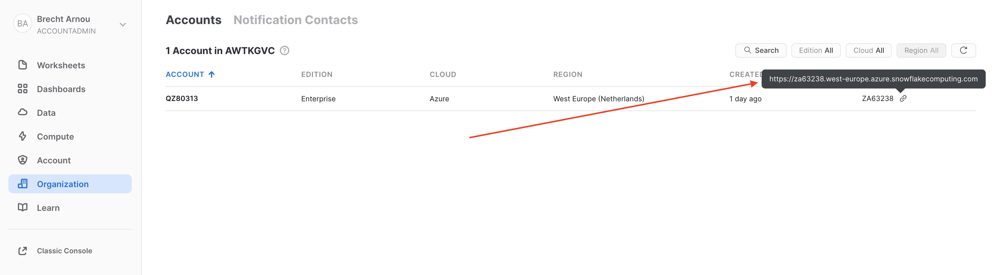

# Snowflake

### Summary

This document explains the steps needed to prepare your Snowflake environment for setting up a dScribe connection. The connection we use is the Key Pair Authentication that Snowflake provides.

### Step-by-step guide

1. Generate an encrypted private key in your terminal via the following command

```
openssl genrsa 2048 | openssl pkcs8 -topk8 -inform PEM -out rsa_key.p8t
```

&#x20;2\. Select a private keyphrase to encrypt the key, and keep this keyphrase somewhere safe (you'll need it later)

&#x20;3\. Generate the public key based on your private key

```
$ openssl rsa -in rsa_key.p8t -pubout -out rsa_key.pub
```

&#x20;4\. Assign the public key to the snowflake user via the following command

```
ALTER USER dscribe SET RSA_PUBLIC_KEY='MIIBIjANBgkqh...';
```

&#x20;5\. You can verify if your private key will work to connect to your Snowflake system via the SnowSQL cli&#x20;

```
$ snowsql -a <account_identifier> -u <user> --private-key-path <path>/rsa_key.p8
```

&#x20;Your account identifier can be found in the Snowflake cockpit via Organization&#x20;

.png>)

The account identifier of the example above is 'AWTKGVC-QZ80313'

If you connection is verified you can move to the next step

&#x20;6\. Collect the following information to add in dScribe

&#x20; \- Your account URL

&#x20;

&#x20; \- Your account identifier as described above

&#x20; \- Your private key

&#x20; \- Your key passphrase

&#x20; \- Username of the snowflake user

7\. Using the **Account identifier**, **Private key, Passhphrase** and **Username**, you can now create a new Connection in dScribe.

**Reached the end? Congratulations! You’re a star!** :star:****


