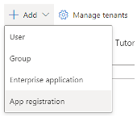
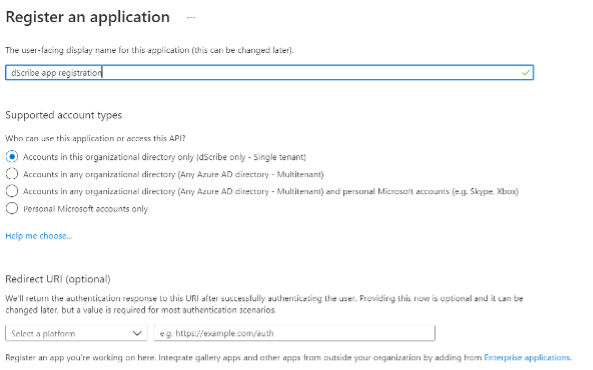
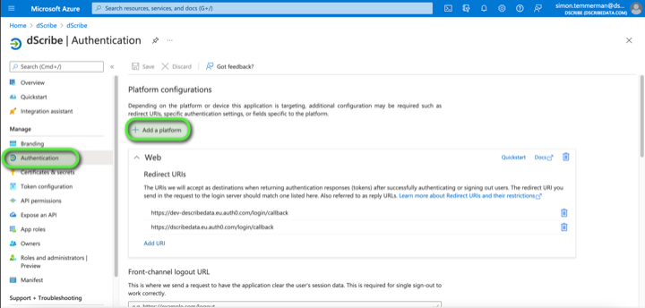
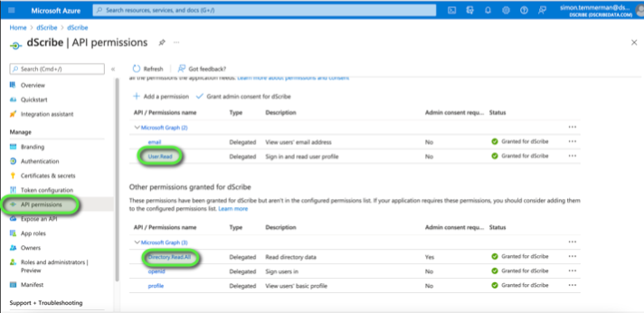
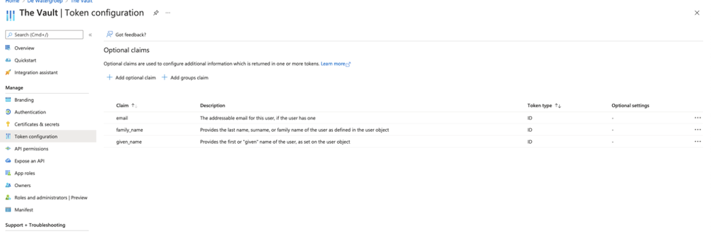
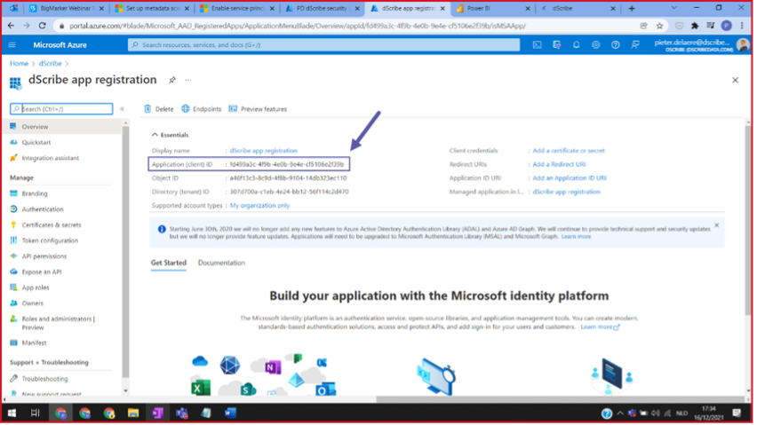
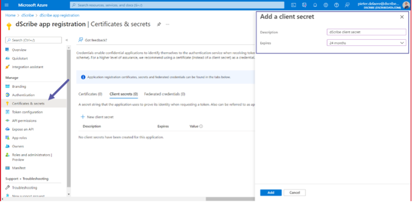
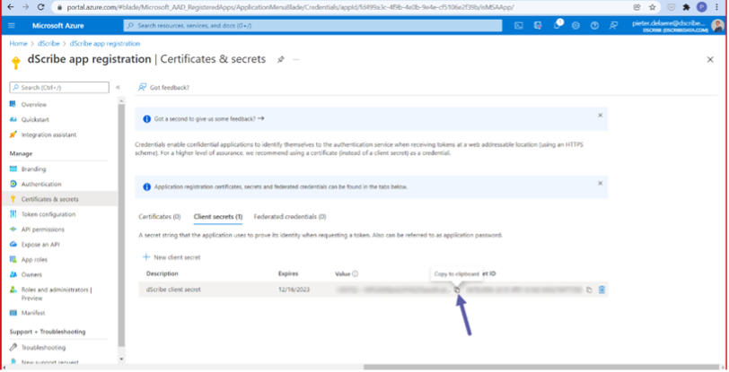
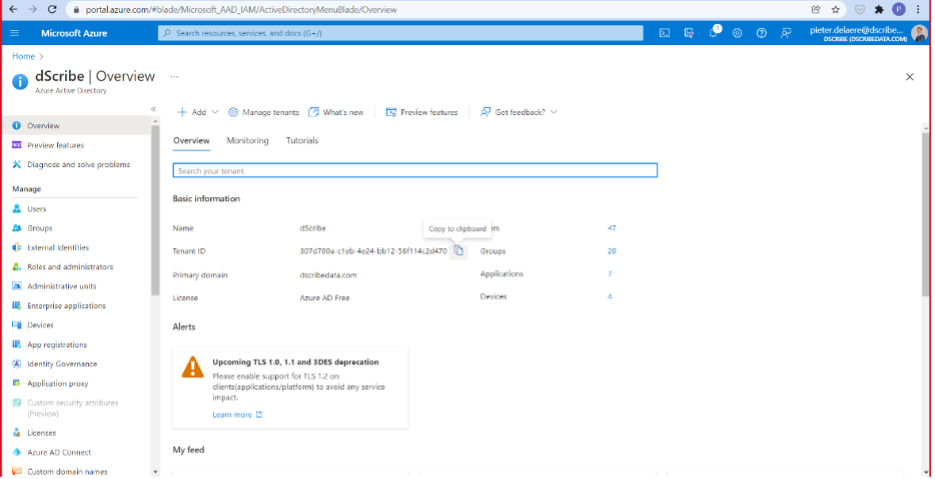

# Azure AD

### 1. Go to Azure Active Directory (AAD)

a.     Go to [https://portal.azure.com/#home](https://portal.azure.com/#home)

b.     Select Azure Active Directory:

### 2. Create an app registration


remember the name of your application, you will need it later


### 3. Go to the newly created application and click on authentication. Select create add a platform.

Select web and enter the following redirect url: [https://dscribedata.eu.auth0.com/login/callback](https://dscribedata.eu.auth0.com/login/callback).

### 4. API permissions tab&#x20;

and check if the following permissions are granted: **User.Read and Directory.Read.All**

### **5. Token configuration**

Make sure at least the email is included in the token:

### 6. Application

Navigate back to your application via Azure Active Directory > App Registrations > Select your newly created App and copy the **Application (client) ID** somewhere safe. You will need it later.

### 7. Client Secret

In your application, navigate to 'Certificates & secrets' and create a new client secret:

and copy your client secret (it will not appear again once you navigate away from the page):

### 8. Tenant ID

Go back to Azure Active Directory > Overview and copy the **Tenant ID**

