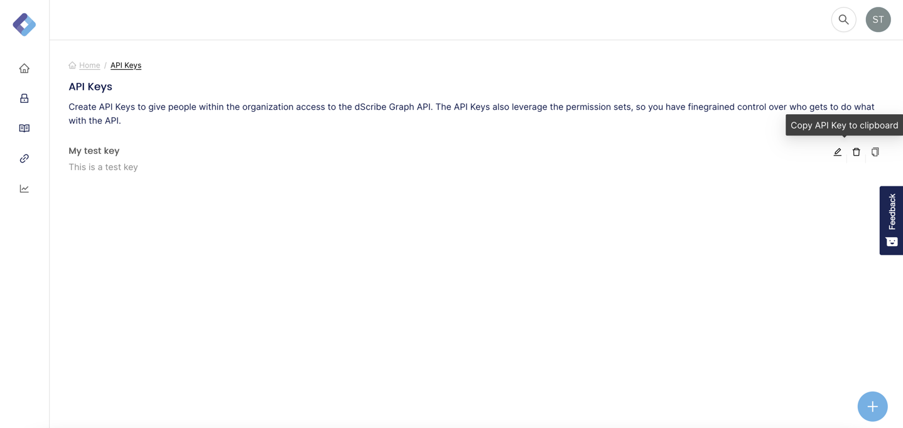

# Quick Start

## Get your API keys

The first thing you have to do is get an API key. Go to the dScribe Portal and navigate to the admin section. Find the API keys menu item and click on it. You should see something like this:

.png>)

Create a key with the following settings:



**Good to know**: here we are creating a superuser token. This means it will have permissions to do everything within the app. If you want to create a restricted token, look at our guides around security and add the necessary permissionsets to the token.


Copy the token by clicking on the copy icon:



This token can now be exchanged for an access\_token _to make authenticated requests. To get_ an access_\__token, make the following request (in postman or in the browser):&#x20;



The token will be valid for 24 hours



The API key you obtained above



```javascript
{
    access_token: "eyJhbGciOiJSUzI1NiIsInR5cCI..."
}
```




**Good to know:** As mentioned above, restrict access to your resources by applying permission sets to your API keys.


## Make your first request

Lets start by getting listing all the reports stored in the dScribe graph.


[openapi.yaml](.gitbook/assets/openapi.yaml)



**Good to know:** Listing of objects from the graph will always be paginated.&#x20;


Take a look at how you might call this method using our official libraries, or via `curl`:



```
curl https://{your_tenant}.dscribedata.com/api/report/list
    -H "Authorization: Bearer ${INSERT ACCESS_TOKEN}" 
```


