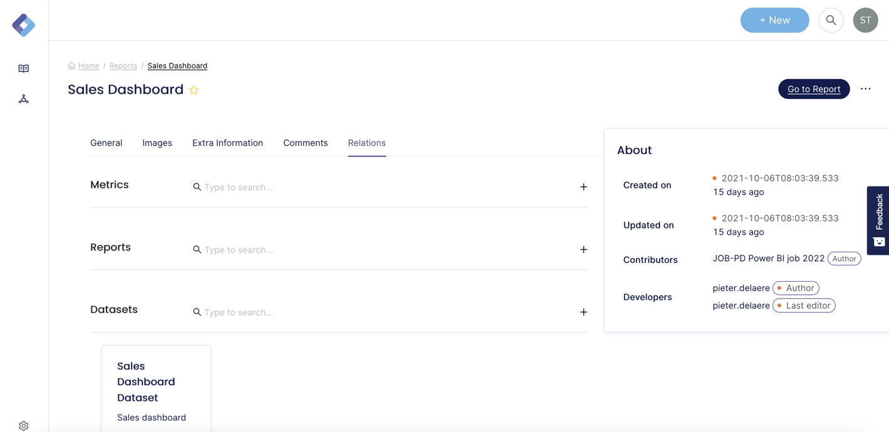

# Relations

The metadata stored within dScribe is represented as a graph. This means relations between the different nodes are treated as a first class citizen. The API supports connecting and disconnecting nodes.

The relations can be found in the dScribe application under the relation tab:



Let us take the same example as before:



This query will update the reports passed in. 







```javascript
{
  "failed": 0,
  "retry": 0,
  "successful": 0,
  "time": 0,
  "total": 0
}
```



```javascript
{
  "code": "string",
  "message": "string"
}
```



```javascript
{
  "code": "string",
  "message": "string"
}
```



```javascript
{
  "code": "string",
  "message": "string"
}
```



The request body looks like this:

```json
[
  {
    "REPORTID": "string",
    "CALC_FORMULA": "string",
    "CALC_FORMULAFULLTEXT": "string",
    "CALC_FORMULAHTML": "string",
    "DESC": "string",
    "DESCFULLTEXT": "string",
    "DESCHTML": "string",
    "INTERPRETATION": "string",
    "NAME": "string",
    "PROPERTIES": {
      "{readable_id}": [
        "string"
      ]
    },
    "REPORT": {
      "connect": [
        {
          "where": {
            "node": {
              "{FIELD}": "string",
              "{FIELD}_CONTAINS": "string",
              "{FIELD}_IN": [
                "string"
              ],
              "{FIELD}_NOT": "string",
              "{FIELD}_NOT_CONTAINS": "string",
              "{FIELD}_NOT_IN": [
                "string"
              ]
            }
          }
        }
      ],
      "disconnect": [
        {
          "where": {
            "node": {
              "{FIELD}": "string",
              "{FIELD}_CONTAINS": "string",
              "{FIELD}_IN": [
                "string"
              ],
              "{FIELD}_NOT": "string",
              "{FIELD}_NOT_CONTAINS": "string",
              "{FIELD}_NOT_IN": [
                "string"
              ]
            }
          }
        }
      ]
    },
    "VIEW": {
      "connect": [
        {
          "where": {
            "node": {
              "{FIELD}": "string",
              "{FIELD}_CONTAINS": "string",
              "{FIELD}_IN": [
                "string"
              ],
              "{FIELD}_NOT": "string",
              "{FIELD}_NOT_CONTAINS": "string",
              "{FIELD}_NOT_IN": [
                "string"
              ]
            }
          }
        }
      ],
      "disconnect": [
        {
          "where": {
            "node": {
              "{FIELD}": "string",
              "{FIELD}_CONTAINS": "string",
              "{FIELD}_IN": [
                "string"
              ],
              "{FIELD}_NOT": "string",
              "{FIELD}_NOT_CONTAINS": "string",
              "{FIELD}_NOT_IN": [
                "string"
              ]
            }
          }
        }
      ]
    }
  }
]
```

Notice the keys REPORT and VIEW? This means that a REPORT can be linked to other REPORTs and VIEWs.


The relations the API supports right now are: **REPORT, VIEW, COLUMN**


Connecting and disconnecting can be controlled via the connect and disconnect key. Sending a body like this will connect REPORT 1 with REPORT 2.


Only one type of connection can be made at any given time. In other words, you can only connect a REPORT with another REPORT or a VIEW. You cannot connect a REPORT with another REPORT and VIEW **in one call**. You will have to split them up.


```json
[
  {
    "REPORTID": "REPORT 1",
    "REPORT": {
      "connect": [
        {
          "where": {
            "node": {
              "REPORTID": "REPORT 2"
            }
          }
        }
      ]
    }
  }
]
```

Look at the fields reference to see what fields you can use within the API.


[reports-fields.md](reference/field-reference/reports-fields.md)

